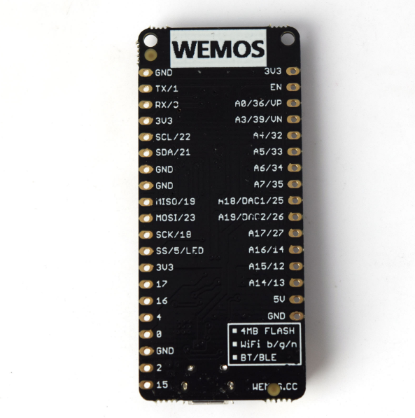
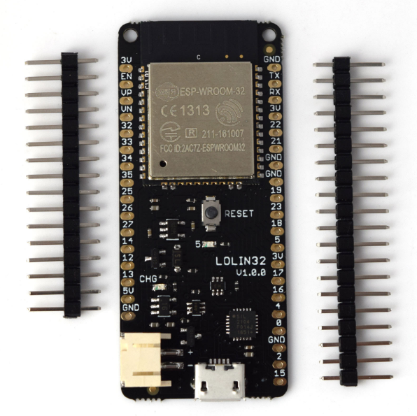

# ESP32 weather station

## Hardware used:
- ESP32 - Wemos Lolin32
- PMS5003 connected to 17 (TX), 16 (RX) (Serial2), pms enable pin4, 5V
- MH-Z14A - CO2 sensor connected to 36(VP) ADC pin, 5V
- BME280 - temperature and humidity sensor connected to 21(SDA), 22(SCL) pins, 3.3V
- Neopixels - for status indication, connected to pin 2, 5V (to be coded later)
- LCD 2004 (4 rows with 20 chars) connected through I2C Serial Interface Adapter Module PCF8574 (powered through 5V, so logic level converter had to be used for SDA and SCL)
- 2N7000 for logic level converter (2pcs)
- BC546 NPN transistor and photoresistor (pin 39(VN) via 10k pull up to 3.3V resistor) for automatic LCD brightness adjustment

## Design decisions:
- MH-Z14A has a high current draw, so the LCD is affected, I had to use 1F 5.5V capacitor - to be document
- logic level converter inspired by http://www.hobbytronics.co.uk/mosfet-voltage-level-converter
- free SDA/SCL connectors (both 3.3V and 5V) left free for future use
- LCD brightness can be adjusted by photoresistor in modes:
  - through analog circuit - connected directly to the BC546 transistor
  - in digital way - photoresistor value can be read by ADC (32 pin) and ~~the desired output value can be set by DAC_1 (25 pin) - also through BC546 transistor~~ by 25 pin in PWM through BC546 transistor driving P-channel MOSFET.
- neopixel data pin driven from 3.3V, however it is 5V logic level (according to docu 80%*Vcc=4V for high state) - it works somehow...

## Reference:

## Issues

- cannot detect ESP32 from PC - no serial port

Troubleshoot:
- open case and check
- disconnect BME280 and check
- disconnect Neopixels and check
- remove 5V PC-board and attach external 5V
- do not use super-cap ?
