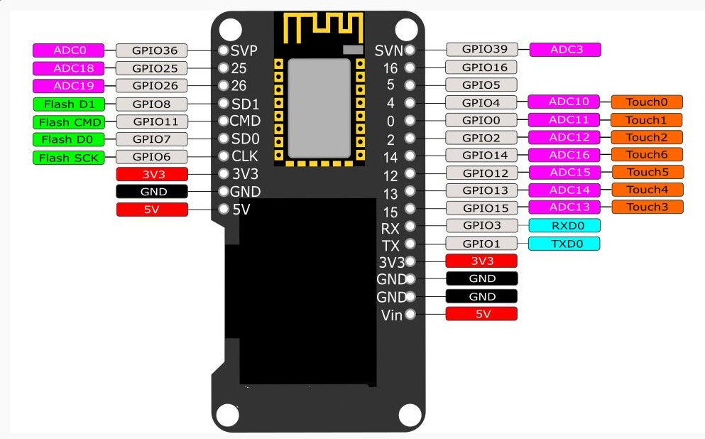

# ESP32_weather_station

## Hardware used:
- ESP32 with OLED display (connected internally to pins 4, 5)
- PMS5003 connected to 25 (TX), 26 (RX) (Serial1 - with custom pins)
- Sharp GP2Y10 connected to 39 (VN) (ADC - through voltage divider) and 14 (through logic converter)

## Reference:

